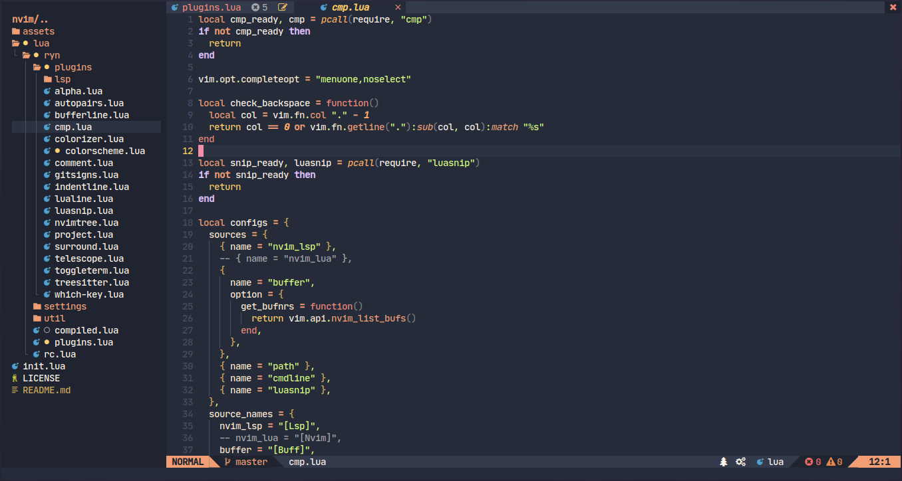
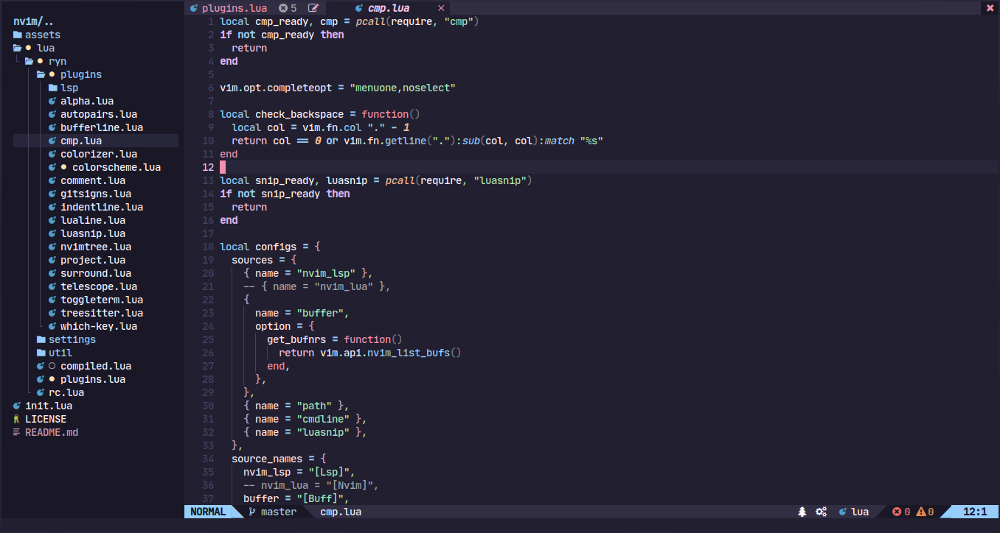
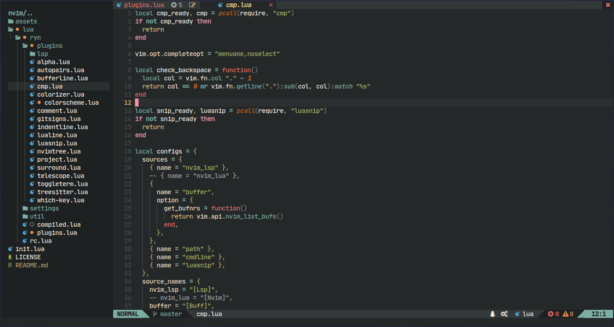
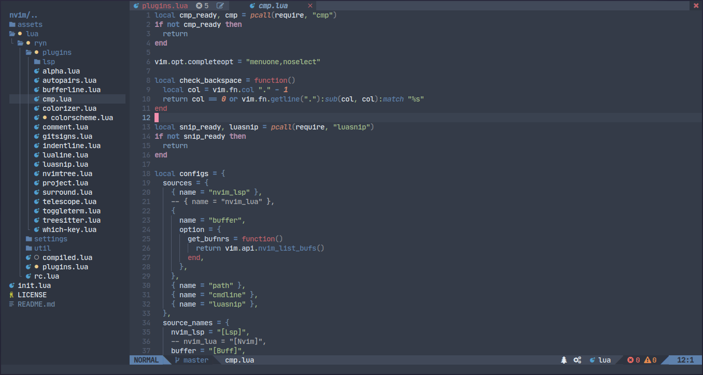
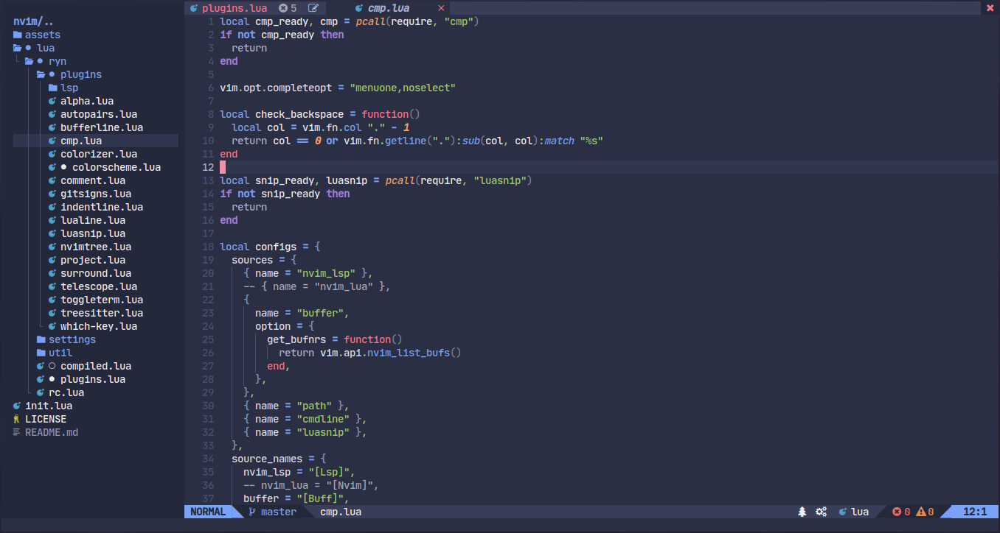
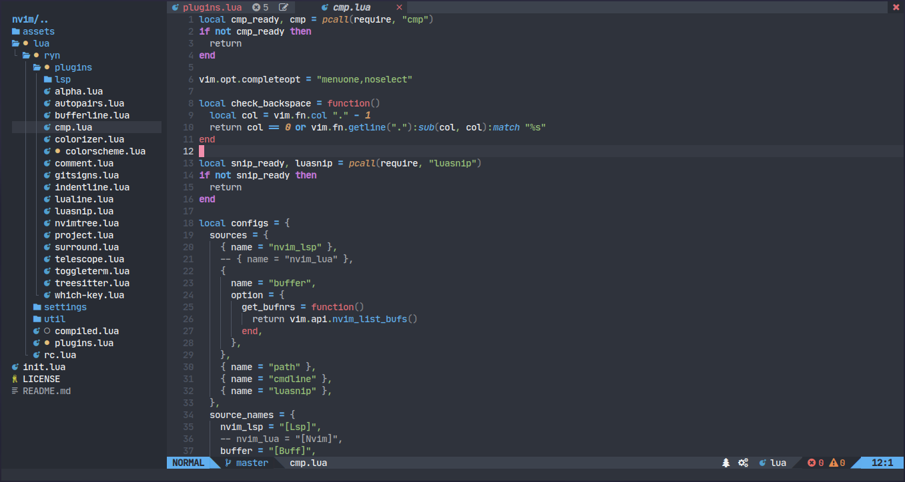

# Rynkai, ... for now 
> This plugins is for my neovim config. But you can use it if you set some dafault value to suit yout personal configs.

This variation doesn't follow any theme creation rules, even with the colorscheme. For now `rynkai` just have one flavour. Will add if have another, or you make it and let me taste what you like.

## Flavours

`Ayu (Mirage)`
 

There is some flavour for now. `ayu`, `catpuccin`, `gruvbox`, `tokyonight` and more. Check on `colors` dir.

<details><summary>Showcase <b>(Click to expand!)</b></summary>

`Catppuccin`

`Gruvbox`

`Nord`

`Tokyonight`

`Onedark`


</details>

*** Credits for all creator of all colorscheme.

## What's includes?
- **telescope** extensions
- **lualine** themes

### Plugins supports

- [Telescope](https://github.com/nvim-telescope/telescope.nvim)
- [NvimTree](https://github.com/kyazdani42/nvim-tree.lua)
- [WhichKey](https://github.com/liuchengxu/vim-which-key)
- [BufferLine](https://github.com/akinsho/nvim-bufferline.lua)
- [Lualine](https://github.com/hoob3rt/lualine.nvim)

## Installation
> For colorscheme switcher function can work properly, `packer` and `telescope` is a must. If you are not depends on this feature, it's ok to leave this two.

[packer.nvim](https://github.com/wbthomason/packer.nvim)

```lua
use 'qqhgs/rynkai.nvim'
```

## Usage

```lua
-- Lua
vim.cmd("colorscheme rynkai")
```

How to enable `rynkai` for `lualine`
```lua
require('lualine').setup {
  options = {
    -- ... your lualine config
    theme = 'rynkai'
    -- ... your lualine config
  }
}
```

## Configuration
> Configuration needs to be set **BEFORE** loading the color scheme with `colorscheme rynkai`

This is default value:
```lua
require("rynkai").setup({
	config_file = "lua/colorscheme.lua", -- where you locate this config*
	rynkai_dir = vim.fn.stdpath("data") .. "/site/pack/packer/start/rynkai.nvim/lua/rynkai/colors/", -- this is why you need packer and telescope**
	theme = "catppuccin", -- style
	italic = {}, -- there is some group italic style
	bold = {}, -- there is some group have bold style
	term_colors = true,
})
```
`config_file` and `rynkai_dir` exist for working with telescope extensions function.
* The function is search this path, find line with `theme = "blabla"` then `blabla` will be replace with new string. So your setup must have `theme = "blabla"` line too.
* Change this value to suit yout plugins manager. The function will grep all colors then bring to telescope pickers.
* You need to call the extensions from your telescope config file. after that you can run `Telescope rynkai`

This is how i use it on my configs.
```lua
require("rynkai").setup {
	theme = "ayu", -- this field is a must for some function
	config_file = "lua/ryn/plugins/colorscheme.lua", -- without slash include in front
	rynkai_dir = "/site/pack/packer/opt/rynkai.nvim/lua/rynkai/colors/", -- slash in front is a must
}
vim.cmd [[ colorscheme rynkai ]]
require("telescope").load_extension "rynkai"
vim.api.nvim_set_keymap(
	"n",
	"<Leader>st",
	":Telescope rynkai<CR>",
	{ noremap = true, silent = true }
)
```

## Builtin
* `lua require("rynkai.fn").cycle()` will cycle the color scheme. This work without telescope.
* `lua require("rynkai.fn").change(String)` @String colorscheme name.
* Check on `fn.lua` for more details 

## Build your own style
Basicly, we use base16. But rynkai use hsluv function to set the brightness of background and accent color for some group. So we just need to provide 8 basic colors.
So can we say that this base8? idk. `bg` will be base for any background. `accent` will be base for foreground. Feel free to browse this repo and make fork.

# Todo
- [ ] Refactor
- [ ] Improve
- [ ] Add more features
- [ ] Add more flavour
- [ ] Build awesome README
