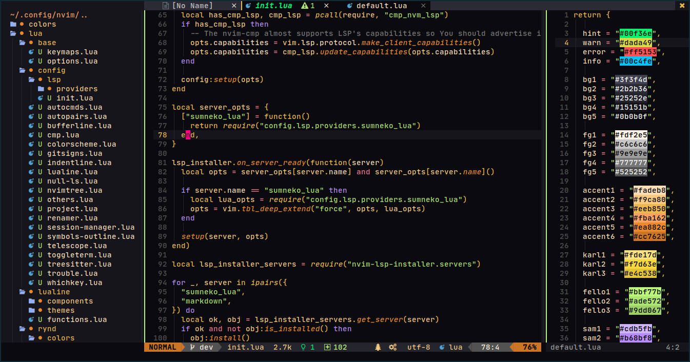

# Rynkai, ... for now 
<hr>

This variation doesn't follow any theme creation rules, even with the colorscheme. For now `rynkai` just have one flavour. Will add if have another, or you make it and let me taste what you like.

## On screen



## What's includes?
- **lualine** themes

### Plugins supports

- [Telescope](https://github.com/nvim-telescope/telescope.nvim)
- [NvimTree](https://github.com/kyazdani42/nvim-tree.lua)
- [WhichKey](https://github.com/liuchengxu/vim-which-key)
- [BufferLine](https://github.com/akinsho/nvim-bufferline.lua)
- [Lualine](https://github.com/hoob3rt/lualine.nvim)

## Installation

Depends on what is your package manager.

[packer.nvim](https://github.com/wbthomason/packer.nvim)

```lua
use 'qqhgs/rynkai.nvim'
```

## Usage


```lua
-- Lua
vim.cmd("colorscheme rynkai")
```

```vim
" Vim script
colorscheme rynkai
```

How to enable `rynkai` for `lualine`
```lua
require('lualine').setup {
  options = {
    -- ... your lualine config
    theme = 'rynkai'
    -- ... your lualine config
  }
}
```

## Configuration
> ❗️ configuration needs to be set **BEFORE** loading the color scheme with `colorscheme rynkai`

For now, this is an example of the function with the default values
```lua
require("rynkai").setup({
	italics = {
		functions = false,
	},
})
```

# Todo
- [ ] Refactor
- [ ] Add more features
- [ ] Add more flavour

# License
Source is avaiable under the [Mit License](https://github.com/qqhgs/rynkai.nvim/blob/master/LICENSE)
